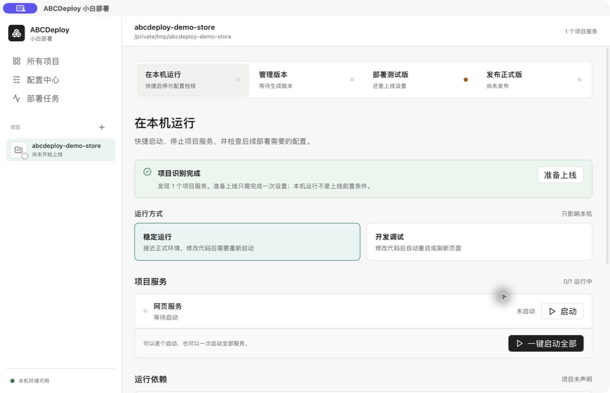
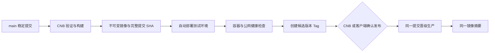

# ABCDeploy 小白部署

[](https://github.com/blacksco0920-dot/abcdeploy/actions/workflows/ci.yml)
[](https://github.com/blacksco0920-dot/abcdeploy/actions/workflows/release.yml)
[](LICENSE)

面向 vibe coding 用户的引导式容器化部署桌面客户端。选择代码目录后，ABCDeploy 会只读识别项目，并通过“在本机运行、管理版本、部署测试版、发布正式版”四个稳定场景，引导完成 CNB 构建、服务器部署、Caddy HTTPS、版本验证和生产发布。

**[访问官网与国内下载](https://abcdeploy.finagent.cloud)** · **[开源仓库与备用下载](https://github.com/blacksco0920-dot/abcdeploy/releases)**



> 当前为 `0.2.0-preview.4`。适合试点和测试环境；正式业务上线前仍应确认数据库备份、域名归属和平台代码签名状态。

## 为什么做这个项目

传统部署工具往往先要求用户理解镜像、流水线、SSH、反向代理和环境隔离。ABCDeploy 把这些知识变成推荐默认值和可恢复步骤：系统能判断的自动完成，必须由用户授权的操作明确展示。

- 重新打开应用会自动恢复项目与部署进度。
- 持久侧边栏同时展示多个项目；切换项目不会中断其他构建任务。
- CNB 账号、镜像仓库和服务器可以跨项目复用；配置中心只保存常用的“配置说明、配置名称、配置值”。
- 只需本地开发时可独立生成项目 `.env`，无需配置 CNB、镜像仓库、服务器或域名。
- 只填写服务器地址，自动发现或生成本机 SSH 身份。
- 内部安全值自动生成，第三方配置按测试/生产分别保存。
- 代码只构建一次；多个测试通过版本可以同时保留，正式发布时明确选择其中一个同一提交和镜像摘要。
- DNS、HTTPS 或应用路由异常会给出对应处理方式，不重复构建镜像。
- 回滚只切换上一健康镜像，不修改数据库、域名和运行配置。

## 默认发布模型

`main` 是稳定代码和发布候选来源，不等于“直接部署生产服务器”。默认流程只有一次构建：



测试和生产只共享已验证的程序镜像。两套环境的域名、变量、数据库、容器网络和发布记录始终独立。

| 环境          | 默认位置 | 用途                     | 更新方式                |
| ------------- | -------- | ------------------------ | ----------------------- |
| `development` | 本机     | 编码、调试、本地依赖     | 用户自己的开发工具      |
| `staging`     | 服务器   | 验证真实镜像、依赖和路由 | `main` 稳定提交自动部署 |
| `production`  | 服务器   | 正式用户访问             | 测试健康后人工确认晋级  |

## 支持能力

- 识别 NestJS、Next.js、Vite、UniApp、Taro、Prisma、通用 Node.js 项目和多包工作区。
- 生成 `deploy.yaml`、Docker Compose、Caddy 和 CNB 流水线；默认部署链路不依赖 GitHub。
- 使用通用 OCI 镜像仓库契约，国内默认推荐腾讯云 TCR，也可使用 CNB Docker 制品库。
- 使用内置纯 Rust SSH，支持 RSA/Ed25519 私钥和固定服务器指纹。
- 为每个项目生成独立流水线身份，用户登录私钥不会上传到 CNB。
- 使用操作系统钥匙串保存 Token、可复用连接凭据与开发、测试、生产三份完整运行配置文件。
- 保留部署记录、完整提交 SHA、CNB 构建编号和回滚结果。
- 失败时展示稳定错误码、处理步骤和可折叠技术详情。
- 提供 Rust CLI `deployctl`，用于自动化、Schema 生成和排障。

## 安装

优先从 [ABCDeploy 官网](https://abcdeploy.finagent.cloud) 下载；无法访问时可使用 [GitHub Releases](https://github.com/blacksco0920-dot/abcdeploy/releases) 备用入口：

- macOS Apple Silicon / Intel：`.dmg`
- Windows x64：预览版提供 NSIS `.exe`；稳定版再同时提供 `.msi`
- Linux x64：`.AppImage` 或 `.deb`

Alpha 安装包尚未配置商业代码签名证书时，系统可能显示来源提示。请只从本仓库 Release 下载，并核对发布页面资产。

### 从源码运行

需要 Node.js 22、pnpm 11、Rust 1.97 和对应平台的 [Tauri 2 系统依赖](https://v2.tauri.app/start/prerequisites/)。

```bash
git clone https://github.com/blacksco0920-dot/abcdeploy.git
cd abcdeploy
pnpm install
pnpm dev
```

仅使用命令行：

```bash
cargo run -p deployctl -- preflight
cargo run -p deployctl -- inspect /你的项目目录
cargo run -p deployctl -- init /你的项目目录
```

`init` 默认只预览。写入部署文件必须显式追加 `--write`。

## 首次部署

### 1. 准备必要资源

| 资源         | 最低要求                                             | 用途                          |
| ------------ | ---------------------------------------------------- | ----------------------------- |
| CNB 访问令牌 | 代码读写、构建记录、仓库管理、构建触发和创建仓库权限 | 保存代码、查看版本并触发构建  |
| OCI 镜像仓库 | 国内试点默认腾讯云 TCR，也可使用 CNB 制品库          | 保存不可变项目版本            |
| Linux 服务器 | 可通过 SSH 登录，并允许明确确认后的安装或配置操作    | 运行测试/生产容器和统一 Caddy |
| 域名         | 可选，A/AAAA 记录指向服务器                          | Caddy 自动申请 HTTPS          |

只做远程部署时，本机不强制安装 Docker Desktop 或项目运行时；它们只用于本机完整预览。项目代码仍需要 Git 作为版本来源。

### 2. 在“管理版本”完成一次设置

添加项目由侧边栏统一完成，不算部署步骤。首次准备上线只需处理当前真正缺少的一项：

1. **连接代码平台**：复用或创建 CNB 代码仓库；没有 Git 时由系统安全建立 `main` 和首次提交。
2. **保存项目版本**：验证并使用 TCR 或其他 OCI 镜像仓库；唯一已验证连接会自动复用。
3. **准备测试环境**：连接 Linux 服务器，保存独立测试配置，准备测试地址或本机安全预览。
4. **开启自动部署**：在 CNB 网页完成一次安全保存。

完成后，把准备上线的代码合并到项目主分支即可自动生成版本并更新测试版。客户端主要用于确认测试结果、处理异常，以及从测试通过的版本中发布正式版。

### 3. 按需完成 CNB 网页安全保存

ABCDeploy 可以通过 API 创建普通私有代码仓库，但 CNB 密钥仓库当前仍需在 Web 页面创建和编辑：

1. 应用先打开 CNB 创建或编辑页，并明确显示需要保存的文件名。
2. 应用只在内存中生成当前项目和环境的完整安全配置。
3. 用户复制内容、粘贴并保存，再回到应用明确确认结果。
4. 停点会跨重启恢复；确认保存后，如果剪贴板仍是刚才的安全配置，客户端会主动清空。

安全配置包含 ABCDeploy 为该项目创建的流水线私钥、已确认的服务器公钥和对应环境的完整运行配置文件。内容只在用户点击复制时交给前端，不写入 SQLite、项目目录或日志。

CNB 密钥仓库说明见 [官方文档](https://docs.cnb.cool/zh/repo/secret.html)。

## 生成文件

```text
deploy.yaml                                      项目部署协议
.cnb.yml                                        构建、测试、生产晋级与部署
.deploydesk/generated/<environment>/
  docker-compose.yml                            环境独立 Compose
  Caddyfile                                     项目路由片段
  .env.example                                  变量名与非敏感默认值
  secret.example.yml                            CNB 密钥字段示例
```

`.deploydesk` 是早期版本延续下来的内部兼容协议目录。当前实现继续使用它，避免升级时破坏已部署项目；它不属于用户需要维护的配置入口。

## 安全设计

- Token、流水线私钥和分环境运行配置文件通过操作系统钥匙串保存。
- 服务器首次连接必须人工确认 SHA-256 指纹，后续指纹变化立即停止。
- 流水线使用项目专属 Ed25519 身份，只把公钥幂等写入服务器。
- 只允许自动提交 ABCDeploy 拥有的部署文件；发现业务代码未提交时停止同步。
- 生产发布必须引用测试通过记录中的完整提交 SHA 和不可变镜像摘要，不接受 `latest`，也不重新构建。
- 回滚保留 `.runtime.env`、数据库与 Caddy，只切换 `.release.env` 中的镜像摘要。
- 外部错误在进入 UI 和持久化层前统一脱敏。

更完整的边界和漏洞报告方式见 [SECURITY.md](SECURITY.md)。
面向用户的故障编号见 [错误码说明](docs/archive/v1/error-codes.md)。

## 本地开发

```bash
pnpm install
cargo fmt --all -- --check
cargo clippy --workspace --all-targets -- -D warnings
cargo test --workspace
pnpm --filter @abcdeploy/desktop test
pnpm --filter @abcdeploy/desktop build
pnpm --filter @abcdeploy/site build
```

构建桌面安装包：

```bash
pnpm tauri:build
```

可运行示例位于 [`examples/hello-fullstack`](examples/hello-fullstack)，Ecat 匿名化扫描回归样本位于 [`fixtures/ecat-energy`](fixtures/ecat-energy)。

## 文档

- [产品与实现文档入口](docs/README.md)
- [产品需求文档](docs/product-requirements.md)
- [整体产品工作流](docs/product-workflow.md)
- [用户旅程与信息架构](docs/user-journeys.md)
- [前端页面设计规范](docs/frontend-design-guidelines.md)
- [配置中心与三环境运行模型](docs/configuration-and-runtime.md)
- [当前实现与验收基线](docs/implementation-acceptance.md)
- [历史文档归档](docs/archive/README.md)
- [安全策略](SECURITY.md)
- [贡献指南](CONTRIBUTING.md)

## 当前边界

- CNB Token 仍需要用户在 CNB Web 创建并粘贴一次，等待适合桌面公共客户端的 OAuth/Device Flow 能力。
- CNB 密钥仓库创建与文件保存仍需用户在 Web 页面完成，应用不会模拟浏览器点击或读取登录 Cookie。
- 数据库迁移会被识别，但 Alpha 不会在缺少可验证备份 Provider 时自动执行生产迁移。
- 已有可识别的统一 Caddy 会复用；Nginx、Traefik、未知进程或未知容器占用 80/443 时会停止并解释冲突，不静默替换现有代理。
- macOS、Windows 安装包签名取决于维护者是否配置平台证书。

## 许可证

[Apache License 2.0](LICENSE)
