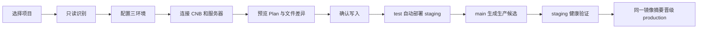

# DeployDesk

[](https://github.com/blacksco0920-dot/deploydesk/actions/workflows/ci.yml)
[](https://github.com/blacksco0920-dot/deploydesk/actions/workflows/release.yml)
[](LICENSE)

面向 vibe coding 用户的引导式容器化部署桌面客户端。选择项目后，DeployDesk 会只读识别技术栈，生成开发、测试、生产三套隔离配置；所有文件先预览差异，确认后才写入。

> 当前为 `0.1.0 Alpha`。建议先接入测试项目，再用于正式业务。DeployDesk 不会替你决定数据库迁移、DNS 归属或生产审批，这些高风险动作会保持显性。

## 能做什么

- 自动识别 NestJS、Next.js、Vite、UniApp、Taro、Prisma 和 pnpm monorepo。
- 将 `development`、`staging`、`production` 与分支、服务器分别建模，不把环境写死在机器上。
- 默认 `test` 自动部署测试环境；`main` 生成生产候选，可选择自动晋级或人工审批。
- 镜像使用提交唯一标签，生产最终使用 `repository@sha256:...` 摘要。
- 生产候选先在 staging 启动并通过健康检查，再标记为已验证；生产复用同一摘要，不重新构建。
- 生成 Docker Compose、Caddy、CNB 流水线、GitHub 到 CNB 同步工作流和密钥字段模板。
- 支持 CNB Docker 制品库或腾讯云 TCR。
- SSH 严格校验 `known_hosts`，部署失败时恢复上一份 Compose、运行变量和镜像摘要记录。
- 桌面端之外提供 `deployctl`，便于自动化和排障。

## 三分钟了解流程



`main` 是稳定代码和生产候选的来源，不等于“把测试服务器上的容器搬到生产”。流水线在仓库中解析候选镜像摘要，staging 和 production 分别拉取同一个 `sha256` 内容，服务器、数据库、密钥和容器命名空间仍然完全独立。

## 安装

### 下载桌面版

在 [Releases](https://github.com/blacksco0920-dot/deploydesk/releases) 下载对应安装包：

- macOS：`.dmg` 或 `.app.tar.gz`
- Windows：`.msi` 或 NSIS `.exe`
- Linux：`.AppImage` 或 `.deb`

Alpha 安装包如尚未签名，操作系统可能显示来源提示。校验 Release 页面提供的 SHA-256 后再安装。

### 从源码运行

需要 Node.js 22、pnpm、Rust 1.97+ 和 Tauri 2 的系统依赖。

```bash
git clone https://github.com/blacksco0920-dot/deploydesk.git
cd deploydesk
pnpm install
pnpm dev
```

构建 macOS 安装包：

```bash
pnpm tauri:build:mac
```

该命令会生成 `.app` 和 `.dmg`，并主动关闭依赖 Finder 的 DMG 图标排版，因此本机与无界面 CI 都能稳定执行。

只使用命令行：

```bash
cargo run -p deployctl -- preflight
cargo run -p deployctl -- inspect /你的项目目录
cargo run -p deployctl -- init /你的项目目录
```

`init` 默认只预览。看过 Plan 后，桌面端点击“应用部署配置”，或在 CLI 显式加 `--write`。

## 首次部署

1. **选择项目目录**

   DeployDesk 只读取依赖、脚本、Dockerfile、Prisma Schema 和 `.env.example` 的变量名，不读取 `.env` 值。

2. **确认识别结果**

   检查服务、框架、容器端口和健康路径。缺少 Dockerfile 时，Plan 会明确列出待生成项。

3. **配置环境**

   测试默认绑定 `test`，生产默认绑定 `main`。服务器名只是逻辑名称，同一台主机也必须使用不同命名空间、数据库和密钥文件。

4. **连接外部服务**

   填写 CNB Token，验证测试/生产 SSH。首次使用新服务器时，SSH 验证成功后勾选授权，再点击“初始化 Caddy”。该操作只创建 `~/.deploydesk` 和 `deploydesk-caddy`；检测到其他 Docker 容器占用 80/443 时会停止。

5. **填写 CNB 密钥仓库**

   DeployDesk 会生成：

   ```text
   .deploydesk/generated/staging/secret.example.yml
   .deploydesk/generated/production/secret.example.yml
   ```

   在 CNB Web 端创建密钥仓库，分别建立 `env.staging.yml` 和 `env.production.yml`，按模板填写后，把两个文件 URL 粘贴到环境配置。真实值不要填进项目里的示例文件。

6. **预览并应用 Plan**

   查看每个文件的写入前/写入后内容。确认后才会原子写入；已有文件备份到 `.deploydesk/backups/<plan-id>/`。

7. **提交配置并推送**

   推送 `test` 后自动部署 staging。合并到 `main` 后，生产候选会再次在 staging 验证；审批模式下，再从 DeployDesk 或 CNB 触发 `api_trigger_production`。

## 你需要准备什么

| 结果 | 怎么获得 | 填在哪里 |
| --- | --- | --- |
| `CNB_TOKEN=<占位>` | CNB 头像菜单进入访问令牌；按需授予仓库读取/管理、构建触发和创建仓库权限 | 桌面端“服务连接”，可保存到系统密钥库 |
| `CNB_BUILD_REPOSITORY=组织/仓库` | 在 CNB 创建普通代码仓库，或授权 DeployDesk 创建 | `deploy.yaml` 的 `providers.build.repository` |
| `STAGING_SECRET_URL=https://cnb.cool/.../env.staging.yml` | CNB Web 创建密钥仓库和文件，复制文件页面 URL | 环境配置中的“CNB 密钥文件” |
| `PRODUCTION_SECRET_URL=https://cnb.cool/.../env.production.yml` | 同上，生产必须使用另一文件 | 环境配置中的“CNB 密钥文件” |
| `SERVER_HOST=<IP或域名>` | 云服务器控制台的公网 IP/内网地址 | 服务连接页和对应密钥文件 |
| `SERVER_USER=<例如 ubuntu>` | 云服务器镜像或管理员提供 | 服务连接页和对应密钥文件 |
| `SERVER_SSH_KEY=<私钥内容>` | 本机已有私钥；公钥需已写入服务器 `authorized_keys` | 本机选择私钥；CNB 密钥文件用 YAML `|` 多行填写 |
| `SERVER_KNOWN_HOSTS=<完整行>` | `ssh-keyscan -p 22 主机` 获取后，与云厂商控制台/管理员提供的指纹人工核对 | 对应 CNB 密钥文件 |
| `域名=<占位>` | 域名服务商添加 A/AAAA 记录指向服务器 | 环境配置；DeployDesk 生成 Caddy 路由 |
| `业务变量=<占位>` | 项目 `.env.example`、第三方平台控制台或业务负责人 | 对应环境的 CNB 密钥文件，字段会带 `STAGING_`/`PRODUCTION_` 前缀 |
| `TCR_USERNAME/TCR_PASSWORD=<占位>` | 仅选择 TCR 时，从腾讯云 TCR 访问凭证获取 | 两个 CNB 密钥文件；默认 CNB 制品库不需要 |

CNB 密钥文件示意，只能在密钥仓库中填写真实值：

```yaml
STAGING_SERVER_HOST: "<服务器地址>"
STAGING_SERVER_PORT: "22"
STAGING_SERVER_USER: "ubuntu"
STAGING_SERVER_SSH_KEY: |
  <私钥多行内容>
STAGING_SERVER_KNOWN_HOSTS: "<核对过指纹的 known_hosts 完整行>"
STAGING_API_GREETING: "你好，测试环境"
```

## 生成文件

```text
deploy.yaml                                      项目部署协议
.cnb.yml                                        CNB 构建、验证、晋级和部署
.github/workflows/sync-cnb.yml                  GitHub 分支同步到 CNB
.deploydesk/generated/<environment>/
  docker-compose.yml                            环境独立 Compose
  Caddyfile                                     项目路由片段
  .env.example                                  运行变量名称
  secret.example.yml                            CNB 密钥字段模板（远程环境）
```

运行状态、真实密钥和备份目录都在 `.gitignore` 中。生成文件可以提交，真实 `.env`、Token、密码和私钥不可以。

## CLI 速查

```bash
deployctl inspect <project> --json
deployctl init <project>                  # 只预览
deployctl init <project> --write          # 显式写入
deployctl plan <project> --json
deployctl apply <project> --yes
deployctl schema --output deploy.schema.json
deployctl preflight
deployctl provider docker
deployctl provider ssh --name staging-server --host HOST --user USER --key KEY
deployctl provider caddy-bootstrap --name staging-server --host HOST --user USER --key KEY --yes
deployctl health https://example.com/health
deployctl release history <project>
deployctl release recover <project> <failed-release-id>
```

CNB 命令只从进程环境读取 `CNB_TOKEN`，不会从参数接收或打印 Token：

```bash
deployctl cnb me
deployctl cnb repositories <组织>
deployctl cnb settings <组织/仓库>
deployctl cnb enable-auto <组织/仓库>
deployctl cnb builds <组织/仓库>
deployctl cnb trigger <组织/仓库> --branch main --event api_trigger_production
```

## 本地开发

```bash
pnpm install
cargo fmt --all -- --check
cargo clippy --workspace --all-targets -- -D warnings
cargo test --workspace
pnpm --filter @deploydesk/desktop test
pnpm --filter @deploydesk/desktop build
pnpm dev
```

可运行示例在 [`examples/hello-fullstack`](examples/hello-fullstack)，Ecat 匿名化只读回归样本在 [`fixtures/ecat-energy`](fixtures/ecat-energy)。

## 文档

- [架构设计](docs/architecture.md)
- [分支、环境与镜像晋级](docs/deployment-model.md)
- [Ecat 只读验证记录](docs/ecat-verification.md)
- [安全策略](SECURITY.md)
- [贡献指南](CONTRIBUTING.md)

## 当前边界

- DNS 记录仍由用户在域名服务商完成，DeployDesk 负责显式提示、生成 Caddy 路由和后续检查。
- 数据库迁移会被识别并写入协议；Alpha 不会在缺少可验证备份方案时擅自执行生产迁移。
- 已有 Nginx/Caddy 占用 80/443 时不会自动替换。可以继续使用现有 Caddy，并手工 `import` DeployDesk 生成的站点目录。
- macOS/Windows 安装包签名取决于维护者是否配置平台证书；CI 未配置证书时产出未签名包。

## 许可证

[Apache License 2.0](LICENSE)
