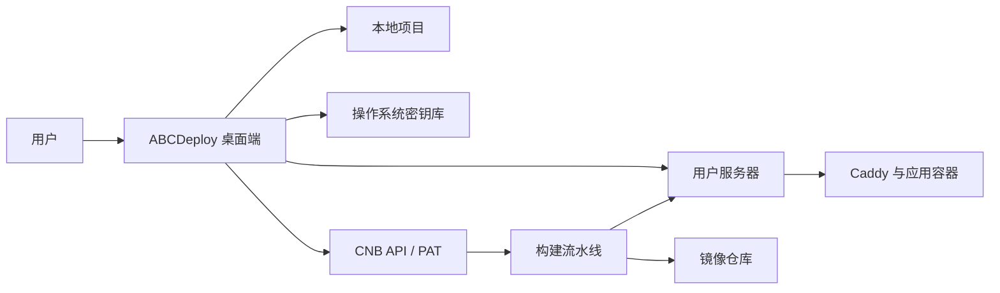

# ABCDeploy 架构决策与外部依赖

> 状态：`0.2.0-preview.4` 封板实施基线，最近与当前工作区对齐于 2026-07-16。本文同时记录已实现决策和正式版仍需完成的外部验证。

## 1. 架构目标

ABCDeploy 的首要约束不是“能生成多少配置”，而是让普通用户在不了解 SSH、镜像仓库和流水线密钥的情况下，仍能获得可恢复、可审计、可回滚的部署结果。

当前架构必须同时满足：

1. 桌面端关闭后，服务器仍能持续接收自动部署。
2. Windows、macOS、Linux 的主流程一致，不依赖 WSL 或用户预装 Bash。
3. 密码、令牌和私钥不进入项目文件、日志、截图或普通配置数据库。
4. 一个 CNB 账号、镜像仓库和服务器可以被多个项目复用。
5. 项目部署规则可进入 Git，个人凭据和本机进度不能进入 Git。
6. 所有生产发布都能追溯到确定的提交和镜像摘要。

## 2. 总体边界

桌面端负责识别、推荐、初始化、验证和展示；CNB 负责持续构建；镜像仓库保存不可变制品；用户服务器负责运行应用。可选云端服务只能承担授权中转、通知和团队协作，不能默认读取项目源码或业务密钥。

## 3. 决策总表

| 编号    | 决策                                                        | 状态     | 研发门禁                           |
| ------- | ----------------------------------------------------------- | -------- | ---------------------------------- |
| ADR-001 | 本地状态使用 SQLite，敏感值使用操作系统密钥库               | 已接受   | 可进入技术验证                     |
| ADR-002 | CNB、服务器、镜像仓库是全局资源，项目仅保存绑定关系         | 已接受   | 可进入研发                         |
| ADR-003 | 无托管后端预览版使用最小权限 PAT；OAuth 留作后续升级        | 已接受   | Token 只进入系统密钥库             |
| ADR-004 | SSH 使用内置 Rust 实现，自动发现或生成专用 Ed25519 Key      | 已接受   | 先完成三平台技术验证               |
| ADR-005 | CNB 密钥仓库保留一次性 Web 人工步骤，客户端提供逐步引导     | 已接受   | 测试与生产文件严格隔离             |
| ADR-006 | 评估轻量服务器 Agent，作为无法无感管理 CI 密钥时的替代方案  | 待验证   | 完成安全与运维原型后再定案         |
| ADR-007 | staging 验证后以同一镜像摘要晋级 production                 | 已接受   | 可进入研发                         |
| ADR-008 | 开源桌面端为主体，可选托管控制面且必须可自托管              | 原则接受 | 明确数据边界和离线降级             |
| ADR-009 | 一条长期 `main`、短期任务分支和同一制品的环境晋级           | 已接受   | 主路径与审批分支回退均保持同一镜像 |
| ADR-010 | Pipeline、Registry、Runtime、Secret、DNS、Approval 分层适配 | 已接受   | 首版实现 CNB + TCR/CNB + SSH/Caddy |

## 4. ADR-001：状态与凭据分层保存

### 决策

- 使用 SQLite 保存项目索引、识别结果、部署检查点、资源元数据和操作历史。
- 使用 macOS Keychain、Windows Credential Manager、Linux Secret Service 保存 CNB Token、SSH 私钥口令、镜像仓库凭据和其他秘密。
- 项目仓库中的 `deploy.yaml` 只保存可公开审查的部署意图，不保存本机路径和敏感值。
- 每次关键流程操作写入检查点，应用异常退出或重启后从最后一个安全状态恢复。

### 项目识别

项目身份由规范化路径、Git remote 指纹和仓库根目录共同判断。项目移动后可通过 remote 指纹重新关联；同一仓库的多个 worktree 分别记录路径，但共享远程仓库身份。

框架识别用于选择更精确的构建、端口和健康检查策略，不作为是否存在服务的唯一依据。非 monorepo 根目录或工作区业务子包只要声明标准 Node.js `start` 或 `start:prod` 脚本，就作为通用网页服务进入规划；工作区根包可能只是统一调度器，不重复识别。系统按 npm、pnpm、Yarn 或 Bun 以及子包目录生成对应安装命令和可审查的多阶段 Dockerfile。项目声明 `build` 时在镜像构建阶段真实执行并把产物带入运行镜像，没有声明时不伪造构建命令。没有框架依赖、没有启动脚本且没有已识别 Python 入口时，才允许进入“没有识别到项目服务”的恢复路径。

包管理器声明和锁文件是两个独立事实。`packageManager` 字段足以选择 npm、pnpm、Yarn 或 Bun，但只有对应锁文件真实存在时才启用 `npm ci` 或冻结锁文件安装；没有锁文件的首次项目使用普通安装，让开发流程先产生锁文件，避免远程构建在业务代码检查前就必然失败。

通用 Node.js 端口只采用项目已经明确给出的非敏感证据：项目自有 Dockerfile 的 `EXPOSE` 优先，其次读取同目录 `.env.example` 的数字 `PORT`、`APP_PORT` 或 `SERVER_PORT`，最后才使用 3000。系统不解释动态表达式，也不读取真实 `.env`，以免猜错或接触用户密钥。

“网页服务”是给用户理解访问方式的展示分类，不等于纯静态前端。通用 Node.js 的运行配置按服务端程序收集：根服务使用完整项目模板，工作区子服务使用自身模板以及根目录的非纯前端变量，确保数据库、端口和密钥真正进入容器；纯 Vite 等静态前端继续只接收公开构建变量。

包管理器只参与镜像构建，不参与生产容器启动。通用 Node.js 运行镜像在构建阶段完成依赖裁剪，启动时进入实际服务目录、补齐本地可执行路径并直接运行项目声明的脚本内容；这样服务器拉取镜像后不需要访问 npm、Corepack 或任何外部仓库。

开发调试同样以服务目录为边界，不以可能重复或含特殊字符的包名作为 Shell 选择器。客户端把绝对容器目录安全引用后交给 npm、pnpm、Yarn 或 Bun 的目录参数，源码挂载仍只发生在本机开发 Compose 中。

### 禁止事项

- 不使用明文 JSON 或 Tauri Store 保存秘密。
- 不把 Token、私钥、密码写入 SQLite、诊断包或遥测。
- 不把用户选择项目的历史仅保存在前端内存或浏览器存储中。

## 5. ADR-002：全局资源与项目绑定

### 数据模型

| 实体                 | 作用                            | 典型字段                             |
| -------------------- | ------------------------------- | ------------------------------------ |
| `Workspace`          | 当前用户的本地 ABCDeploy 工作区 | 名称、默认策略、创建时间             |
| `Project`            | 一个可部署代码仓库              | 路径、Git remote、识别结果、当前阶段 |
| `Resource`           | 可复用外部资源                  | 类型、名称、非敏感连接信息、健康状态 |
| `EnvironmentBinding` | 项目环境与资源的关系            | 项目、环境、服务器、域名、数据库引用 |
| `WorkflowRun`        | 一次构建或部署                  | 提交、镜像摘要、阶段、结果、检查点   |
| `SecretReference`    | 指向系统密钥库的引用            | 所属资源、用途、版本、到期时间       |

`Resource` 至少支持 `cnb_account`、`server`、`registry` 和 `dns_provider`。删除全局资源前必须展示受影响项目，不能静默级联删除。

## 6. ADR-003：CNB 授权

### 预览版决策

预览版不依赖 ABCDeploy 托管后端。主按钮引导用户在系统浏览器打开 CNB Token 页面：

1. 打开正确的 CNB Token 页面。
2. 告知建议名称、最小权限和有效期。
3. 用户粘贴一次，ABCDeploy 立即验证并存入系统密钥库；当前完整能力清单为 `repo-code:rw`、`repo-cnb-history:r`、`repo-manage:rw`、`repo-cnb-trigger:rw`、`group-resource:rw`。
4. 输入框随后只显示账号和到期状态，不回显 Token。

### OAuth 后续升级条件

CNB 已公开 Authorization Code 流程，但公开文档要求应用持有 `ClientSecret`。桌面端属于公共客户端，不能安全内置长期 `ClientSecret`。研发前需由 CNB 明确支持以下任一方式：

1. Authorization Code + PKCE，且桌面端无需长期客户端密钥。
2. Device Authorization Grant。
3. Loopback Redirect + PKCE。
4. 由 ABCDeploy 托管或自托管的授权中转服务保存 `ClientSecret`。

优先级依次为 PKCE、Device Flow、最小化且可自托管的授权中转。未确认前不得把浏览器自动填写、读取 Cookie 或内嵌网页登录作为替代，也不阻塞 PAT 预览版研发。

### 未来 OAuth Token 策略

- Access Token 只进入系统密钥库和进程内存。
- Refresh Token 单独保存，刷新时执行单飞控制，避免并发轮换失效。
- 权限按能力申请，首次不申请未来可能用到的范围。
- 到期前静默刷新；刷新失败时保留本地进度并要求重新授权。
- 断开账号时撤销远端 Token，并清除本地引用。

## 7. ADR-004：服务器接入

### 主流程

1. 自动读取 `ssh-agent`、SSH config 和系统常见 `.ssh` 目录，仅展示可识别身份。
2. 先尝试已有身份，不要求用户理解文件路径。
3. 无可用身份时，生成项目无关的 ABCDeploy 专用 Ed25519 Key。
4. 若用户只有服务器密码，密码只用于首次安装公钥，成功后立即切换到 Key 登录。
5. 若服务器禁止密码登录，提供一键复制公钥和对应云厂商控制台指引。
6. 首次连接必须确认并固定主机指纹；指纹变化视为高风险错误。

### 实现约束

- 使用 Rust SSH 库实现连接、SFTP、端口探测和命令执行。
- 不调用 WSL、`bash`、`sshpass` 或平台特定 shell 作为主流程依赖。
- 预览版使用用户提供并验证过的现有服务器账号，只给该账号幂等安装项目专用公钥；自动创建权限受限的 `abcdeploy` 操作系统用户属于后续安全加固，不能写成当前已实现行为。
- 私钥不可导出到项目目录，日志仅记录 Key 指纹。
- 技术验证覆盖 Windows 11、当前与前一版 macOS、Ubuntu LTS。

## 8. ADR-005：CI 密钥生命周期

### 产品要求

普通用户不能被要求理解或填写：

- CNB 密钥仓库 URL。
- SSH 私钥的文本内容。
- 镜像仓库密码的流水线变量名。
- 原始 `envs.yml` 或 CI YAML。

正式版目标是自动创建最小权限部署身份、写入必要秘密、验证可用性、记录到期时间，并支持轮换和撤销。预览版遵守 CNB 的安全边界，把不能通过受支持 API 完成的动作显性化。

### 必须向 CNB 确认

1. 是否有创建密钥仓库的稳定 API。
2. 是否有创建、更新、列举版本和删除密钥文件的 API。
3. 是否能通过 API 配置流水线所需的加密变量，且响应不返回明文。
4. 是否支持仓库级、环境级权限和 production 审批。
5. 是否能创建可轮换、可撤销、最小权限的部署身份。
6. OAuth Scope 是否覆盖以上能力，审核要求和限流规则是什么。

### 预览版路径

CNB Secret 类型仓库不能 clone，当前支持的公开 API 也不提供文件写入。ABCDeploy 生成带中文说明的测试、生产配置，分别复制到剪贴板并打开准确的 CNB Web 页面；用户完成一次保存后，流水线只引用变量名。界面必须明确这是 CNB 的安全审计步骤，不能宣称全自动。用户确认保存后，若剪贴板仍是刚才生成的安全配置则主动清空；用户已经复制其他内容时不得覆盖。

## 9. ADR-006：服务器 Agent 备选方案

若 CNB 无法通过稳定 API 管理 CI 部署密钥，研发需比较两种路径：

| 方案                                       | 优点                                         | 代价                                     |
| ------------------------------------------ | -------------------------------------------- | ---------------------------------------- |
| CNB Pipeline 通过受限 SSH 部署             | 组件少、与现有流程兼容                       | 私钥生命周期依赖 CNB 密钥能力            |
| ABCDeploy Agent 在服务器拉取已签名部署任务 | 无需把 SSH 私钥交给 CI，可统一回滚与健康检查 | 需要升级、安全更新、任务认证和可用控制面 |

Agent 若进入 P0，必须满足：

- 单容器或单二进制安装，可自动升级与回滚。
- 默认仅发起出站连接，不要求开放管理端口。
- 任务包含项目、环境、镜像摘要、有效期和防重放随机数，并经过签名。
- 以非 root 用户运行；提权能力白名单化。
- 开源协议与桌面端兼容，托管控制面可被自托管实现替代。
- 桌面端离线时，已配置项目仍能正常自动部署。

在威胁建模和 30 天无人值守验证完成前，不选择 Agent 方案。

## 10. ADR-007：构建一次，逐级晋级

默认分支提交只构建一次镜像。staging 验证通过后，production 发布引用相同的镜像摘要，不重新构建，也不把 staging 的数据库或配置复制到 production。

“同一镜像”指同一业务制品；“不同环境”仍使用各自独立的域名、环境变量、数据库、存储卷和访问权限。这样生产上线的是已经测试过的代码，而不是把测试环境整体搬到生产。

测试通过是版本资格，不是“最后一次测试”的单一指针。多个不可变版本可以同时保留为生产候选；每次发布或恢复必须绑定明确版本，未决生产任务完成或取消前不得替换候选。

## 11. ADR-008：开源桌面端与可选控制面

### 原则

- 本地项目识别、配置生成、服务器初始化和凭据保管属于开源桌面端能力。
- 团队协作、跨设备同步、授权中转和通知可以由可选控制面提供。
- 用户不登录 ABCDeploy 账号也应能完成单机核心流程。
- 控制面必须公布收集字段、保存期限、删除方式和自托管边界。
- 任何涉及源码、业务环境变量或服务器 Shell 的远程传输都需单独授权。

### 跨设备

项目规则随 Git 同步；全局资源仅同步非敏感元数据；凭据默认不跨设备同步。新电脑通过重新授权或端到端加密的恢复包接入，不能从云端以明文恢复。

## 12. ADR-009：主干开发与环境晋级

### 决策

- 新项目只保留 `main` 一条长期分支。
- AI 或开发者在短期 `feature/<task>` 分支工作，合并后删除。
- development、staging 和 production 使用 CNB 原生部署环境表达，不创建同名长期分支。
- `main` 更新后构建一次并自动部署 staging；production 只能晋级 staging 已验证的同一镜像摘要。
- 主路径由 ABCDeploy 使用 CNB 构建触发能力执行生产晋级，不依赖业务 `production` 分支。
- 令牌缺少触发权限时，可以把已验证的完整提交推送到专用 `deploydesk-production` 控制分支，并由仓库内 `cnb:apply` 调用同一生产流水线。该分支不承载业务代码分叉、不重新构建镜像，也不计入版本目录或测试状态。

### 理由

三条长期环境分支需要反复合并，容易产生漂移、冲突和“分支已更新但服务器未更新”的双重状态。把发布身份固定为完整提交 SHA 与镜像摘要后，分支只需解决代码协作，部署环境由独立状态机管理。

### 兼容策略

- 导入已有 `test/main`、`staging/main` 或 `main/production` 项目时，先保持现有触发规则。
- 新默认只应用于新项目或用户明确确认的迁移。
- CNB H5 的原生部署和审批页面必须真机验收；若交互不可用，可在 `main` 分支详情页生成“发布正式”按钮，但不改变分支模型。

完整流程见 [分支、环境与版本晋级（历史基线）](archive/v1/deployment-model.md)。

## 13. ADR-010：厂商适配边界

### 决策

- CNB 是首版 Pipeline Provider，不是所有产品模型的命名空间。
- TCR 是国内轻量服务器的推荐 OCI Registry Provider；CNB 制品库是少配置一套账号的回退，其他云厂商 Registry 与 Harbor 可按同一契约扩展。
- Registry 必须分别保存构建端 `push endpoint` 和服务器端 `pull endpoint`，两者可因地域、内网和云厂商不同而不同。
- Runtime、Secret、DNS、Approval 和 Reverse Proxy 各自拥有独立适配器，不能用一个云厂商选择同时控制所有能力。
- 同一服务器允许跨项目并行构建，但 Compose 与 Caddy 变更使用服务器级锁串行执行。

### 不变量

任何 Provider 组合都必须维持：完整提交可追溯、镜像按摘要部署、测试与生产配置隔离、生产显式审批、发布后从目标运行态复核摘要。

## 14. 威胁模型摘要

| 风险                 | 默认控制                                               |
| -------------------- | ------------------------------------------------------ |
| Token 或私钥进入日志 | 结构化日志字段白名单、敏感值检测、诊断包二次扫描       |
| 恶意仓库诱导执行命令 | 识别阶段只读；生成后展示高风险动作；命令使用结构化参数 |
| SSH 中间人攻击       | 首次展示指纹、后续严格固定、变化时阻断                 |
| OAuth Token 权限过大 | 最小 Scope、短期 Access Token、可撤销 Refresh Token    |
| 供应链镜像被替换     | 使用镜像摘要、生成制品清单、可选签名验证               |
| production 误发布    | 环境视觉区分、人工晋级、影响范围确认、可回滚           |
| 控制面被攻破         | 最少持有秘密、端到端加密、租户隔离、审计和自托管       |
| 本机被窃取           | 系统密钥库、自动锁定、敏感操作重新认证                 |

## 15. CNB 官方确认模板

向 CNB 提交以下问题，并要求提供稳定文档或可验证示例：

> 我们正在开发面向桌面端公共客户端的开源部署工具 ABCDeploy。请确认 OAuth 是否支持 PKCE、Device Flow 或无需在客户端内置 ClientSecret 的 Loopback Redirect；相关 Scope、Token 生命周期和应用审核流程是什么？另外，是否有稳定 API 用于创建密钥仓库、写入或轮换密钥文件、配置加密流水线变量，以及创建最小权限部署身份？上述能力是否允许第三方 OAuth 应用调用？

答复、验证日期、接口版本和测试结果必须记录到本文。仅有口头答复不能解除研发门禁。

## 16. 正式版放行检查表

- [x] 预览版 PAT 最小权限、验证和系统密钥库保存完成实现。
- [x] CNB 密钥仓库一次性 Web 操作在产品中显性展示。
- [ ] CNB 公共客户端授权方式完成真实账号验证后替换 PAT 主路径。
- [ ] CI 密钥创建、使用、轮换和撤销获得稳定 API 后完成端到端验证。
- [ ] SSH 连接在三种操作系统均不依赖额外运行时。
- [ ] 本机数据库损坏与应用中断恢复测试通过。
- [ ] 系统密钥库不可用时有明确阻断和修复指引。
- [ ] Agent 与纯 SSH 路径完成书面取舍并通过安全评审。
- [ ] 生产晋级、回滚和审计记录模型通过测试。
- [ ] CNB H5 的 staging 查看、production 审批和部署流程完成手机真机验收。
- [ ] 控制面的数据边界、隐私说明和自托管方案可评审。

## 17. 官方参考

- [CNB OAuth 应用开发](https://docs.cnb.cool/zh/oauth/developer.html)
- [CNB 访问令牌](https://docs.cnb.cool/zh/guide/access-token.html)
- [CNB 密钥仓库](https://docs.cnb.cool/zh/repo/secret.html)
- [CNB 自定义部署流程](https://docs.cnb.cool/zh/build/deploy.html)
- [CNB 手动触发流水线](https://docs.cnb.cool/zh/build/web-trigger.html)
- [CNB 访问令牌页面](https://cnb.cool/profile/token)
- [DORA：Trunk-based development](https://dora.dev/capabilities/trunk-based-development/)
- [Microsoft：Windows OpenSSH 密钥管理](https://learn.microsoft.com/zh-cn/windows-server/administration/openssh/openssh_keymanagement)

上述链接用于确认当前公开能力；涉及稳定性、权限和第三方应用审核的结论仍需 CNB 书面答复与隔离账号验证。
