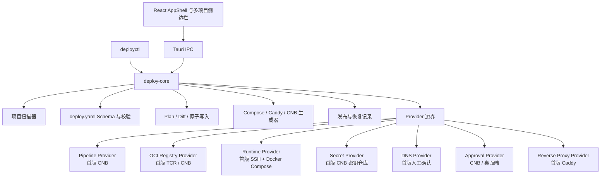
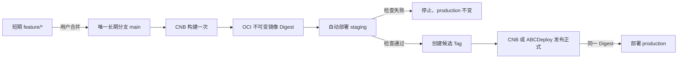

# 架构设计

## 目标

ABCDeploy 把部署拆成可检查的模型、确定性生成和受控执行三层。桌面端负责引导，不直接拼接部署脚本；CLI 和桌面端共同调用 Rust 核心，确保同一项目得到同一 Plan。

## 模块



### `deploy-core`

- `scanner`：只读遍历受限深度，忽略 `.git`、`node_modules`、构建产物；解析 `package.json`，记录 `.env.example` 的路径与键名，不读取真实 `.env`。
- `model`：项目、服务、三环境、Provider、发布策略、Plan 和恢复记录的强类型模型。
- `manifest`：YAML 解析、JSON Schema、隔离规则和注入防护。
- `render`：确定性生成 Compose、Caddy 和 CNB 工作流；导入已有项目时可保留其源码同步配置。
- `plan`：比较写入前后内容、统一脱敏、校验相对路径、原子写入和备份。
- `journal`：记录发布摘要、已完成步骤、失败原因和上一个健康版本。
- `providers`：流水线、OCI 镜像仓库、运行时、密钥、DNS、审批和反向代理的外部边界。CNB、TCR、SSH + Docker Compose 和 Caddy 是首版适配器，不是写死在模型中的唯一厂商。

### `deployctl`

命令行是核心能力的薄适配层。它适合 CI、自动化测试和桌面端无法启动时排障，不维护第二份部署逻辑。

### `apps/desktop`

React 只持有当前表单草稿和展示状态。顶层 `AppShell` 始终展示项目列表和每个项目的独立部署状态；切换项目不会停止其他项目的 CNB 任务。项目扫描、Schema 校验、Plan、写入、密钥库和外部连接都通过 Tauri IPC 进入 Rust。最近项目、服务器绑定、活动任务和部署记录由 Rust 写入本机 SQLite，重新打开应用可以恢复原项目、原步骤和后台任务。

真实 Token 使用操作系统密钥库：

- macOS：Keychain
- Windows：Credential Manager
- Linux：Secret Service/兼容后端

## 数据流

1. 用户选择项目目录。
2. 扫描器生成 `InspectionReport`，不读取真实 `.env`。
3. 运行配置步骤读取项目公开的 `.env.example` 原文，用户分别编辑测试与生产副本；整份内容进入系统密钥库，不改写模板。
4. 若不存在 `deploy.yaml`，核心根据识别结果生成默认 Manifest。
5. Schema 校验环境隔离、仓库路径、域名、镜像标签和密钥引用。
6. Render 生成候选文件；Plan 读取现有文件并产生脱敏 Diff。
7. 用户确认后，Apply 先备份已有文件，再逐个原子替换。
8. 桌面端只暂存并提交自己拥有的部署文件，通过临时认证 Header 同步到 CNB 的短期任务分支或 `main`。
9. 短期 `feature/*` 分支合并到 `main` 后，CNB 从密钥仓库取得整份运行配置并写为 `.runtime.env`，构建一次不可变镜像并上传所选 OCI Registry；国内轻量服务器默认推荐 TCR。
10. 同一镜像摘要先自动部署 staging；检查通过并读取服务器实际摘要后，流水线为完整提交创建 `deploydesk-<commit>` 候选标签。
11. 用户在 CNB 原生部署页或 ABCDeploy 批准 production；两个入口调用同一个生产流水线，按测试候选摘要部署且不重新构建。
12. 桌面端轮询 CNB 最近构建并同步手机/Web 端发起的 `tag_deploy`，再从目标服务器核对实际摘要。

## 代码与发布拓扑



默认不创建 `dev`、`test`、`staging` 或 `production` 长期分支。分支负责代码协作，环境负责运行程序，完整提交 SHA 和镜像摘要负责版本晋级。完整规则见 [分支、环境与版本晋级](deployment-model.md)。

## 三环境模型

环境、分支和服务器不是同一个概念。新项目环境继承 `main` 产生的候选版本；`branch` 只用于兼容已有项目的环境分支绑定：

```text
EnvironmentConfig
  target.kind       local | server
  target.server     逻辑服务器名
  target.namespace  容器/网络隔离名
  branch            兼容已有项目的可选覆盖，新项目默认不填写
  domains           服务路由
  database          可选，只有检测到数据库时生成
  redis_namespace   可选，只有检测到 Redis 时生成
  secrets_ref       本地密钥库或 CNB 密钥文件
```

测试和生产即使在同一物理服务器，也必须使用不同 namespace、数据库名称、Redis 前缀、密钥文件和发布记录。

## 服务器目录

ABCDeploy 使用远程登录用户自己的目录，不默认要求 root：

```text
~/.deploydesk/
  apps/<project>/<environment>/
    docker-compose.yml
    .runtime.env
    .release.env
    Caddyfile
    .history/
  caddy/
    Caddyfile
    docker-compose.yml
    sites/
    data/
    config/
```

`.deploydesk` 是已发布部署协议的兼容路径。V2 保留它以避免破坏在线项目，产品品牌和新接口统一使用 ABCDeploy。

每个项目/环境有唯一 Docker 网络和服务别名，例如 `shop-production-api`。中央 Caddy 可以连接多个网络，而不会把不同项目都叫作 `api` 的服务解析错。

同一物理服务器允许多个 CNB 构建并行执行，但 Compose 切换、Caddy 网络连接和热加载通过 `$HOME/.deploydesk/locks/server-deploy.lock` 串行执行，避免两个项目同时修改共享运行面。

服务器已有统一 Caddy 时，ABCDeploy 只在满足以下契约后复用：容器内挂载 `/etc/caddy/sites`、主 Caddyfile 导入 `sites/*.caddy`、SSH 用户可写对应宿主机目录。客户端记录实际容器名与目录，流水线动态连接项目网络并热加载；不额外启动第二个反向代理，也不重写主 Caddyfile。未知服务占用 80/443 时停止并返回 `AD-SRV-201`。

## 发布事务

远程更新采用 `.next` 和 `.previous`：

1. CNB 在本地生成 `.runtime.env` 与 `.release.env`。
2. 通过严格 host key 校验的 SCP 上传为 `.next`。
3. 服务器备份当前 Compose、运行变量、摘要记录和 Caddy 片段。
4. 原子替换，执行 `docker compose config`、`pull`、`up --wait`。
5. 成功后写入 `.history/<release>.env` 并 reload Caddy。
6. 失败且存在上一版本时，恢复 `.previous` 并重新启动。

数据库迁移不属于可无条件回滚的文件事务。Alpha 只声明迁移命令；没有经过验证的备份 Provider 时不自动执行生产迁移。

## 扩展 Provider

Provider 应满足以下约束：

- 输入使用结构化类型，不接收任意 shell 片段。
- 错误先脱敏再进入 UI/日志。
- 只读检查和写操作分开；写操作需要显式确认。
- 所有外部标识先校验或编码。
- 测试可以替换 API Base URL 或使用隔离资源，不依赖生产状态。

计划中的后续扩展包括 Gitee/GitLab 流水线、其他云厂商 OCI Registry、云服务器 Runtime、DNS Provider 和可插拔数据库备份 Provider。新增适配器不得改变“构建一次、摘要晋级、环境隔离和生产审批”的发布语义。
