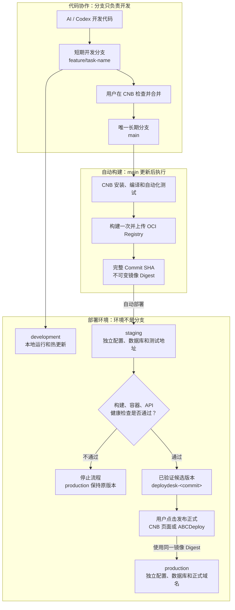

# 分支、环境与版本晋级

本文记录 ABCDeploy V1 已确认的默认发布模型。它适用于新接入的国内个人开发者和小团队项目；已有流水线先识别和兼容，不静默改造。

## 核心原则

三个概念必须分开：

- 分支负责代码协作。
- 环境负责运行程序。
- 完整提交 SHA 和镜像摘要负责标识可发布版本。

`development`、`staging`、`production` 是部署环境，不是三条长期代码分支。服务器也只是环境绑定的运行目标，不能反过来决定分支模型。

## 默认分支模型

| 类型        | 默认名称         | 生命周期 | 用途                                 |
| ----------- | ---------------- | -------- | ------------------------------------ |
| 稳定主线    | `main`           | 永久     | 保存已经合并的稳定代码并产生发布候选 |
| AI 开发任务 | `feature/<task>` | 短期     | 隔离单次功能、修复或 AI 开发任务     |
| 测试分支    | 不创建           | 无       | staging 由 `main` 的不可变版本驱动   |
| 生产分支    | 不创建           | 无       | production 由部署审批驱动            |

短期开发分支合并后应删除。`dev`、`develop`、`test`、`staging` 和 `production` 只作为导入已有项目时的兼容分支名，不作为新项目默认值。

## 完整发布流程



## 三个环境

### development

- 默认在本机运行，使用热更新和本地共享基础设施。
- 开发代码来自当前短期任务分支。
- 不因保存代码而触发远程生产部署。

### staging

- `main` 更新后，CNB 构建一次不可变镜像并自动部署。
- 使用独立运行配置、数据库、Redis 前缀、容器网络、目录和测试地址。
- 构建、容器、API 和公网检查通过后，当前完整提交及镜像摘要才成为已验证候选。
- 候选标签只在 staging 部署及摘要核对成功后创建，默认命名为 `deploydesk-<完整提交SHA>`。

### production

- 只有已通过 staging 的候选版本可以发布。
- 用户可在 CNB 原生部署页面或 ABCDeploy 中执行同一个“发布正式”动作。
- 生产流水线按已记录的镜像摘要部署，不重新构建。
- 使用独立生产配置、数据库、Redis 前缀、持久化目录和正式域名。

## CNB 发布能力

ABCDeploy 为项目生成 CNB 的三环境部署配置：

- `.cnb/tag_deploy.yml` 定义 `staging` 和 `production` 的原生部署入口；development 默认留在本机，不要求远程环境。
- production 要求 staging 已成功，并配置发布权限或审批人。
- `.cnb.yml` 的生产事件只解析并部署已验证镜像摘要。
- CNB 原生部署页面作为 Web/手机发布入口，ABCDeploy 是桌面入口；两者调用同一生产流水线，并按 CNB 构建序号同步为同一类发布记录。
- 如果 CNB H5 的原生部署页验收不合格，可在 `main` 分支详情页提供“发布正式”自定义按钮，但不因此增加生产分支。

## “使用测试通过的同一镜像摘要”

它不是复制测试服务器的容器，也不会让生产共用测试数据库：

1. `main` 的完整提交生成唯一镜像。
2. staging 按镜像摘要启动并完成检查。
3. ABCDeploy 保存完整提交、镜像摘要和测试发布记录。
4. production 使用相同摘要启动，但注入自己的配置和数据连接。

这样可以证明生产运行的就是测试通过的程序，避免同一源码因二次构建产生不同制品。禁止使用 `latest` 作为生产版本依据。

## 用户需要理解的动作

普通用户只需要看到：

```text
AI 开发完成
  -> 合并代码
  -> 自动部署测试环境
  -> 打开测试地址确认
  -> 发布正式
```

分支名、CNB 事件、TCR 地址和镜像摘要放在技术详情中。主界面以“开发中、测试中、可以发布、生产正常”等业务状态表达。

## 失败与恢复

- 构建失败：不更新 staging 和 production。
- staging 不健康：恢复上一测试版本，production 保持不变。
- production 不健康：恢复发布前版本并保留失败记录；Compose 更新期间仍可能出现短暂不可用，不能宣传为零停机。
- DNS 或 HTTPS 未就绪：保留已经健康的容器，只把公网入口标记为待处理。
- 回滚：选择上一条健康发布记录，按其不可变镜像摘要重新部署；数据库恢复是独立高风险操作。

## 现有项目兼容

导入项目时检测 `dev`、`develop`、`test`、`staging`、`production`、现有 CNB 规则和服务器发布记录：

- 已有 `test/main` 且正在稳定发布时，先保持原行为。
- 已有 `production` 审批分支时，继续识别为兼容触发通道。
- 完成一次现状基线检查后，再向用户推荐迁移到 `main + 环境晋级`。
- 未经用户确认，不创建、删除或重新绑定已有分支。

## 试点验收项

架构和流水线已经实现，正式版发布前仍需在隔离项目完成以下真机验收：

- CNB 原生部署与审批页面在手机浏览器中的完整可用性。
- CNB 原生部署页能否稳定显示候选标签、审批人和失败原因。
- 候选 Tag 的保留数量和自动清理策略。

这些问题只影响入口形式，不改变“一条长期主线、构建一次、环境晋级”的核心模型。
