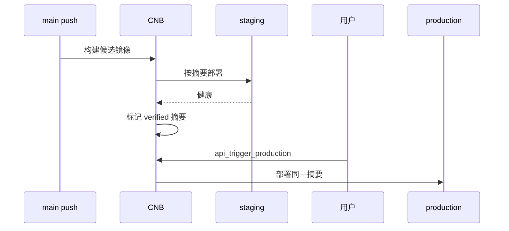

# 分支、环境与镜像晋级

## `main` 的作用

`main` 表示稳定代码线和生产候选来源。它默认触发发布候选流水线，但不等于某台服务器，也不等于生产环境本身。

默认映射：

| 分支 | 行为 | 环境 |
| --- | --- | --- |
| `test` | 安装、验证、构建不可变镜像、自动部署 | staging |
| `main` | 安装、验证、构建生产候选，先部署并验证 | staging |
| `main` 审批/自动晋级 | 拉取已验证摘要，不重新构建 | production |

分支名可修改，环境也可绑定另一台服务器；模型不会把 `main` 写死为服务器地址。

## “使用测试通过的同一镜像摘要”

它不是把测试服务器上的容器复制到生产，也不是让生产共用测试数据库。

流程如下：

1. `main` 提交构建镜像 `image:sha-<commit>`。
2. CNB 查询仓库返回的 `sha256:<digest>`。
3. staging 使用 `image@sha256:<digest>` 启动并等待容器健康。
4. 健康后创建唯一的 `verified-sha-<commit>` 标记，并校验它仍指向原摘要。
5. production 再解析标记，并使用相同的 `image@sha256:<digest>`。

标签帮助人查找版本，摘要才是部署依据。即使标签被意外移动，已经写入发布记录的摘要仍能定位原内容。

## 两种生产模式

### 审批模式（默认）

审批触发必须指定 `main` 的目标版本。若该提交没有已验证标记，生产流水线直接失败，不会偷偷重新构建或退回 `latest`。

### 自动模式

`main` 候选在 staging 健康后，同一条流水线继续加载独立的 production 密钥文件并部署同一摘要。测试和生产密钥字段带不同前缀，避免同时导入时相互覆盖。

## 失败处理

- 构建失败：不产生 verified 标记，不触碰生产。
- staging 不健康：Compose 恢复上一份文件和镜像摘要；生产不可触发。
- production 不健康：恢复 `.previous` 并保留失败版本记录。
- Caddy 未初始化：应用容器可健康运行，流水线输出 `ROUTE_PENDING`，公网路由保持待处理。
- DNS 未解析：部署和容器健康可成功，公网检查单独显示待解析。
- 新提交未通过 staging：不会误用上一个提交的 verified 标记，因为标记包含提交 ID。

## 为什么不用 `latest`

`latest` 会随推送改变，无法证明测试和生产运行的是同一内容，也无法可靠回滚。DeployDesk 的 Manifest 校验会拒绝 `latest` 和不含 `{commit}` 的标签模板，生产 Compose 只接收摘要引用。
