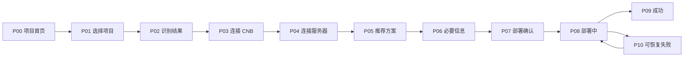
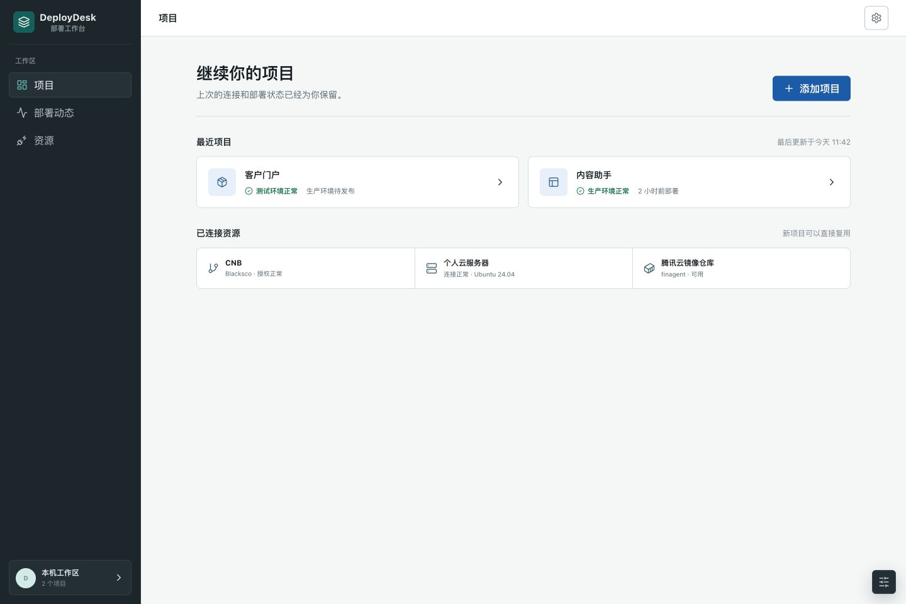
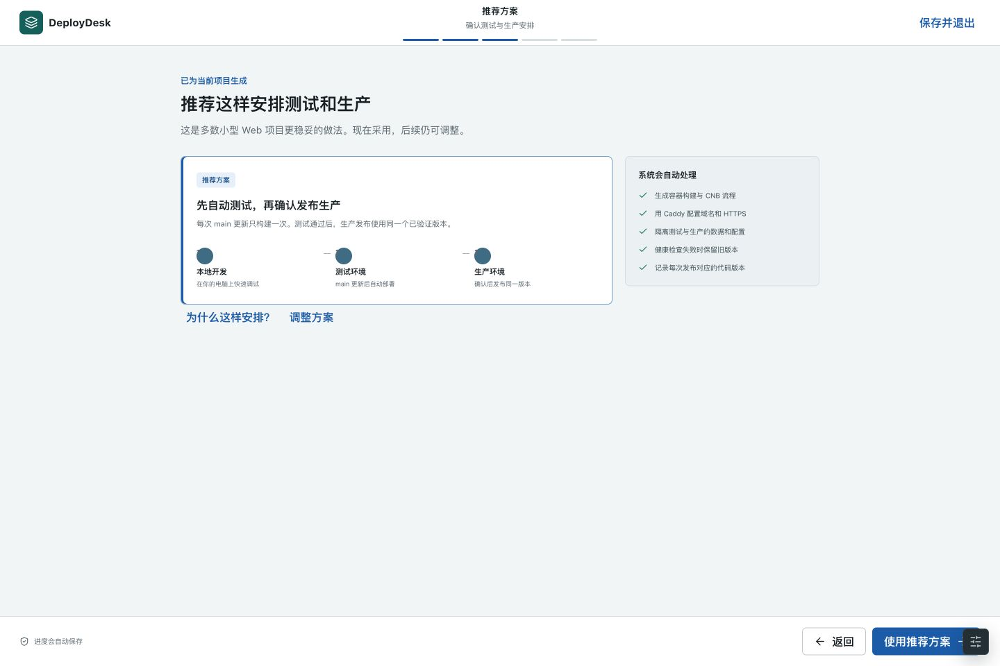
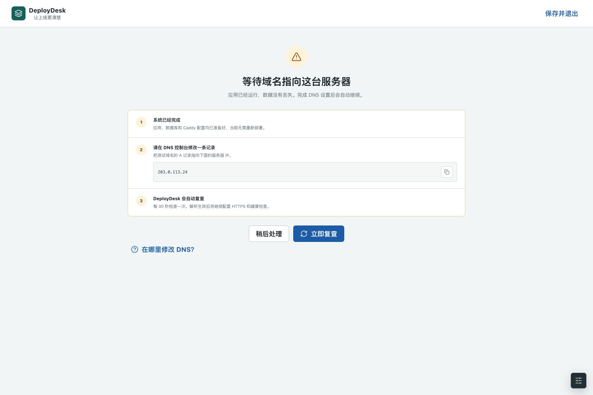

# ABCDeploy V2 可点击原型说明

> 状态：原型制作中。本文定义评审范围和交互，不代表最终视觉稿。

## 1. 原型目标

原型只回答一个关键问题：第一次接触 ABCDeploy 的用户，是否能在没有 DevOps 知识的情况下，理解当前要做什么、为什么需要自己参与，以及完成后会得到什么。

本轮不验证 YAML 编辑器、高级流水线编排、团队权限和商业化页面。

## 2. 画布与视觉原则

- 桌面基准画布为 `1440 x 960`，同时验证 `1280 x 720` 的内容完整性。
- 首次部署是无侧边栏的线性向导；完成后才进入项目工作台。
- 使用安静、工作导向的中性色，蓝色表示主操作，绿色只表示已验证成功，红色只表示阻断。
- 卡片只承载独立选项或项目，不使用卡片套卡片。
- 标题与正文保持正常产品字号，不使用营销式大标题。
- 技术细节默认折叠，展开后仍使用中文解释，不直接倾倒日志。
- 所有图标按钮带可见焦点和悬浮说明；键盘可完成整个黄金路径。

## 3. 黄金路径页面

### P00 返回用户首页

**目的**：验证应用重启后记得项目。

显示最近项目、环境状态、最后一次部署和“添加项目”。点击已有项目进入工作台，点击“添加项目”进入 P01。

核心文案：

- 标题：`继续你的项目`
- 项目状态：`测试环境运行正常`
- 次要信息：`生产环境等待首次发布`

### P01 选择项目

**目的**：只要求用户做其真正理解的选择。

提供“选择本机项目”和“从 Git 地址导入”。本机选择器默认打开最近使用的代码目录；不出现部署配置字段。

选择后立即进入 P02，扫描期间显示真实阶段：读取目录、识别技术栈、检查 Git 状态、查找现有部署规则。

### P02 识别结果

**目的**：建立信任，允许纠错，但不把检测结果变成表单。

示例结果：

- `Vue 3 前端`
- `Node.js API`
- `PostgreSQL 数据库`
- `已有 main 分支，尚未配置测试环境`

主操作为“结果正确，继续”。“有一项不对”展开小范围纠错。详细证据放在“查看识别依据”。

### P03 连接 CNB

**目的**：完成源码托管与构建授权。

页面只显示“登录 CNB 并授权”一个主操作，说明将获得哪些能力。点击后进入系统浏览器，成功返回时自动显示账号头像、用户名和权限检查结果。

授权不可用时才显示“使用访问令牌”，并打开正确页面和最小权限说明。不得出现空白 WebView 或要求用户自己搜索文档。

### P04 连接服务器

**目的**：让用户选择服务器，而不是寻找私钥文件。

默认先扫描已有 SSH 身份和历史服务器：

- 找到可用身份：用户只输入 IP 或域名，系统自动验证。
- 没有 Key：显示“为这台电脑创建安全连接”，生成专用 Key。
- 只有密码：一次性输入密码，系统安装公钥后清除密码。
- 云服务器禁止密码：复制公钥并打开对应云厂商控制台指引。

手工选择私钥位于“其他连接方式”，选择器默认打开系统 `.ssh` 目录。

### P05 推荐方案

**目的**：系统先给答案，用户只做业务判断。

默认选中“推荐方案”：

- 开发环境在本机。
- main 构建不可变镜像并自动部署 staging。
- staging 验证后手工发布同一镜像到 production。
- Caddy 自动配置域名和 HTTPS。
- 数据库、环境变量和存储按环境隔离。

主操作为“使用推荐方案”。“为什么这样安排”和“调整方案”均为次级入口。

### P06 补充必要信息

**目的**：一次只询问系统无法推断的内容。

字段按业务语言分组并解释结果：

- 测试域名，可选择“暂时使用临时地址”。
- 正式域名，可选择“稍后配置”。
- 第三方 API Key，提供“去获取”链接和验证按钮。
- 是否迁移已有数据库；选择“是”后进入独立迁移向导。

所有有可靠行业默认值的字段均不出现。高级变量位于折叠区。

### P07 部署前确认

**目的**：在真正修改外部资源前建立可理解的同意。

页面按结果展示：

- 将在 CNB 创建或更新哪些配置。
- 将在服务器安装哪些基础组件。
- 将创建哪些域名和环境。
- 哪些动作可自动回滚，哪些会保留数据。

风险动作单独标记；主按钮使用结果性文案“部署到测试环境”，不使用“执行”。

### P08 部署进行中

**目的**：用业务阶段代替原始终端输出。

时间线固定为：

1. 准备服务器。
2. 构建应用镜像。
3. 启动测试环境。
4. 配置域名和 HTTPS。
5. 运行健康检查。

每一步显示当前状态、耗时和一句解释。“技术详情”可展开经过脱敏的日志。关闭应用后任务继续，重开恢复到当前阶段。

### P09 部署成功

**目的**：给用户清晰结果和下一步，而不是只有绿色提示。

显示可点击测试地址、健康状态、提交版本和自动部署规则。主操作为“打开测试环境”，次操作为“进入项目工作台”。production 显示为下一项待办，不诱导立即发布。

### P10 可恢复失败

**目的**：验证错误处理是否面向行动。

以 DNS 未生效为例：

- 发生了什么：域名尚未指向当前服务器。
- 系统已完成什么：应用已运行，HTTPS 配置已准备。
- 用户需要做什么：复制目标 IP 到 DNS 控制台。
- 接下来：系统每 30 秒自动复查，也可立即重试。

保留“稍后处理并返回项目”，不把用户困在向导里。

## 4. 项目工作台

完成首次部署后，固定信息架构为：

| 导航 | 用户问题             | 默认内容                             |
| ---- | -------------------- | ------------------------------------ |
| 项目 | 我的服务现在怎么样   | 环境状态、访问地址、最近部署、待办   |
| 部署 | 哪个版本去了哪里     | 提交、镜像摘要、阶段、结果、回滚     |
| 环境 | 测试和生产有什么不同 | 域名、资源绑定、非敏感变量、健康状态 |
| 资源 | 项目用了哪些公共资源 | CNB、服务器、镜像仓库、数据库引用    |
| 设置 | 我要改项目规则       | 项目名称、策略、高级配置、移除项目   |

全局账号、服务器和镜像仓库管理放在应用级设置，不重复出现在每个项目的首次向导中。

## 5. 关键交互连线

## 6. 原型必须覆盖的变体

- 已有项目恢复与新增第二个项目。
- CNB OAuth 成功、取消和权限不足。
- 自动发现 SSH Key、自动生成 Key、密码引导安装公钥。
- 推荐方案直接采用与展开高级配置。
- staging 成功、DNS 等待、健康检查失败并自动回滚。
- 应用在 P06 和 P08 关闭后重新打开。

## 7. 文案规则

1. 按钮描述结果，例如“连接这台服务器”“部署到测试环境”。
2. 不把 `registry`、`digest`、`secret repository` 当作用户必须理解的词。
3. 技术词首次出现时用一句中文解释，例如“镜像是应用可重复运行的安装包”。
4. 错误禁止只写错误码；错误码保留在技术详情中。
5. 不用“很简单”“只需一步”等无法保证的承诺。
6. 永远说明系统是否已经修改外部资源，以及重试是否安全。

## 8. 评审问题

评审原型时只回答以下问题：

1. 新用户能否预测点击主按钮后的结果？
2. 是否有任何字段其实可以由系统推断或附默认值？
3. 必须人工参与的步骤是否解释了原因和获取方式？
4. 关闭应用后，用户是否知道任务会继续还是暂停？
5. 失败后是否存在明确、安全、可恢复的下一步？
6. 用户是否能区分 staging 和 production，但不需要先学习分支模型？

## 9. 可点击原型

- [直接打开原型](prototype/index.html)
- 入口默认展示返回用户首页，点击“添加项目”进入首次部署黄金路径。
- 右下角滑杆图标用于切换返回用户、DNS 异常和重置首次体验场景。
- 页面使用 `localStorage` 模拟本地检查点，刷新后会恢复当前步骤。

当前原型是产品验证资产，不调用真实 CNB 或服务器。Figma 账号存在多个团队空间，在产品负责人确认归档位置前不擅自创建团队文件；该选择不阻塞原型评审和研发门禁判断。

原型通过设计评审前，不作为研发像素级实现依据。
