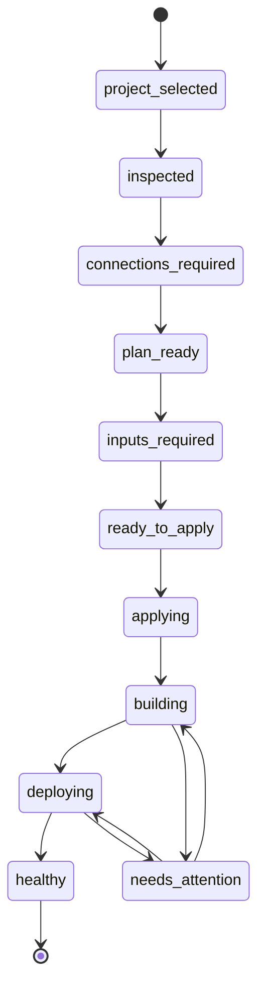

# ABCDeploy V2 用户旅程与信息架构

## 1. 核心交互模型

ABCDeploy 有两个明确的内容模式，并共享同一个应用外壳：

- **初始化向导**：为第一次部署服务，主区域保持线性步骤。
- **项目工作台**：为日常部署和多项目管理服务，不重复初始化问题。

左侧项目栏始终存在，只负责切换项目和展示独立状态；主区域中的步骤或工作台标签负责当前项目。不能再让同一组菜单同时承担“操作步骤”和“日常导航”。


## 2. 首次部署黄金路径

### 步骤 0：启动恢复

系统行为：

- 若只有一个有效的最近项目，自动恢复该项目。
- 若存在未完成流程，显示“继续上次部署：连接服务器”。
- 若有多个项目，显示最近项目和“添加项目”。
- 若项目路径失效，保留项目记录并提供重新定位。

用户不需要做的事：重新选择同一目录、重新连接 CNB、重新填写服务器。

### 步骤 1：选择并识别项目

主界面只显示：

- 项目名称和位置。
- 识别出的产品结构，例如“一个 API、一个管理后台、一个 H5”。
- 是否检测到数据库、缓存和缺失变量。
- 一个主按钮：“继续配置部署”。

低置信度时一次只问一个问题，例如：

> 检测到两个可启动的前端，哪个需要公开访问？

扫描证据、路径和 Dockerfile 进入“识别详情”。

### 步骤 2：连接所需资源

资源按依赖顺序出现，每项都应能独立完成：

1. **CNB 账号**：按指引创建最小权限 Token，粘贴一次后安全保存。
2. **构建仓库**：优先匹配同名已有仓库；没有时建议创建私有仓库。
3. **国内镜像加速**：默认推荐复用 TCR；没有时可先使用 CNB 制品库。
4. **目标服务器**：填写 IP 或域名，自动尝试可用身份。
5. **域名**：首次 staging 可跳过，正式上线前再处理。

已连接的全局资源直接显示“将复用：CNB / finagent-server”，用户只需确认。

### 步骤 3：服务器连接分支

#### 已找到密钥

> 已找到可连接这台服务器的安全凭证。

主操作：“验证并继续”。不显示私钥路径。

#### 没有密钥，但有密码

1. 用户选择“我有服务器密码”。
2. 输入密码并确认仅用于本次安装公钥。
3. 应用生成专用密钥并安装公钥。
4. 立即清除密码，重新使用密钥验证。

#### 只能使用云控制台

1. 应用生成专用密钥。
2. 展示一键复制的公钥。
3. 根据云厂商显示具体入口和字段。
4. 用户完成后点击“我已添加”，应用自动验证。

#### 高级路径

“选择其他私钥”位于次级菜单，文件选择器默认打开系统 SSH 目录。

### 步骤 4：推荐方案

用户看到的是结果，而不是字段：

> 推荐方案：每次更新 `main` 后先自动部署测试环境；验证通过后，你再点击发布正式环境。正式环境使用测试过的同一镜像，不会重新构建。

方案摘要：

- 测试地址：部署完成后生成临时访问方式。
- 正式发布：默认需要确认。
- 服务器：当前先共用一台主机，已启用环境隔离。
- 镜像：国内轻量服务器默认使用 TCR；也可选择 CNB 制品库。
- HTTPS：绑定域名后由 Caddy 自动处理。
- 失败处理：自动恢复上一个健康版本。

主操作：“使用推荐方案”。

替代入口：

- “我只想尽快上线”进入快速方案。
- “我有现成架构”进入高级自定义。

### 步骤 5：只补缺失信息

- **域名**：可跳过 staging，production 前必须完成。
- **运行配置文件**：根据项目 `.env.example` 创建测试、生产两个独立副本。
- 用户直接编辑完整文件，不展示逐变量卡片；项目注释、自定义字段和高级参数原样保留。
- 页面说明文件用于数据库、缓存、第三方服务、端口和功能开关，并提示首次部署、环境差异和密钥轮换等修改场景。
- 保存后的完整内容进入系统密钥库，部署时原样写为服务器 `.runtime.env`。

### 步骤 6：确认并部署

确认页只展示用户影响：

- 将向项目添加 8 个部署文件。
- 将在服务器创建 ABCDeploy 目录、网络和 Caddy 配置。
- 不会删除现有容器、目录或数据库。
- 首次只部署 staging，不会影响 production。

用户确认后进入部署时间线。原始 Diff 位于“查看文件变化”。

### 步骤 7：部署时间线

```text
项目检查          已完成
生成部署配置      已完成
同步构建仓库      已完成
构建 3 个镜像     进行中：2/3
部署测试环境      等待中
健康检查          等待中
```

应用关闭后任务继续；再次打开时恢复时间线。

成功页只给三个后续动作：

1. 打开测试地址。
2. 配置正式域名。
3. 发布正式环境。

## 3. 返回用户旅程

### 启动

- 单个最近项目自动打开项目工作台。
- 显示 staging/production 健康状态和最近版本。
- 若存在失败或待确认动作，显示在页面首位。

### 日常操作

主操作按频率排序：

1. 查看当前状态。
2. 部署测试。
3. 发布正式。
4. 回滚。
5. 查看日志和技术详情。

账号、服务器、环境高级配置不占据首页。

## 4. 第二个项目旅程

1. 用户选择新目录。
2. 系统识别项目。
3. 显示“将复用 CNB 账号和 finagent-server”。
4. 自动检查端口、域名、容器、数据库名称和网络冲突。
5. 用户确认推荐方案并只补新项目专属变量。
6. 进入首次 staging 构建。

目标是让第二项目不再出现 CNB Token、SSH 身份和 Caddy 初始化。

## 5. 失败旅程

### CNB 权限不足

禁止显示原始 `403` 作为主信息。

> ABCDeploy 已连接 CNB，但当前授权不能创建仓库。

主操作：“补充创建仓库权限”。

次级操作：“选择已有仓库”。

### SSH 无法连接

> 服务器可以访问，但没有接受当前安全凭证。

主操作根据检测结果动态选择：

- “使用服务器密码安装密钥”。
- “复制公钥到云控制台”。
- “选择其他密钥”。

### 构建失败

> 管理后台在执行 `pnpm build` 时失败，问题出现在项目代码，不是服务器。

主操作：“让 AI 帮我修复”。

次级操作：“查看关键日志”。

### 健康检查失败

> 镜像已经运行，但 API 在 60 秒内没有通过健康检查。测试环境已恢复到上一版本。

主操作：“查看 API 启动错误”。

### DNS 未生效

> 部署已成功，域名还没有指向服务器。

主操作：“查看需要添加的 DNS 记录”。部署状态不能标记为失败。

## 6. 项目工作台信息架构

左侧项目栏持续显示所有项目及其独立状态。初始化完成后，当前项目使用以下水平标签，避免再嵌套一层侧边栏：

| 导航 | 用户问题                             |
| ---- | ------------------------------------ |
| 项目 | 我的项目现在是否正常？               |
| 部署 | 最近部署到哪一步，是否需要处理？     |
| 环境 | 测试和正式分别运行什么版本？         |
| 资源 | 使用哪个账号、服务器、数据库和域名？ |
| 设置 | 如何调整高级策略或退出连接？         |

“服务连接”不再作为每个项目的一次性菜单。全局资源管理位于应用级设置，项目页只显示绑定关系。

## 7. 信息披露层级

| 默认可见           | 展开后可见         | 仅技术详情可见            |
| ------------------ | ------------------ | ------------------------- |
| 测试环境、正式环境 | 绑定分支和服务器   | 命名空间、Compose Project |
| CNB 已连接         | 授权范围和过期时间 | Token 类型、API 响应      |
| 服务器可用         | 主机指纹和系统版本 | SSH 私钥路径、命令输出    |
| 正在构建           | 当前服务和进度     | Docker 构建完整日志       |
| 将写入部署配置     | 文件数量和风险级别 | 原始 Plan 与 Diff         |

## 8. 状态模型



每次状态变化都需要持久化：当前状态、已完成步骤、可安全重试的下一步和脱敏错误摘要。
